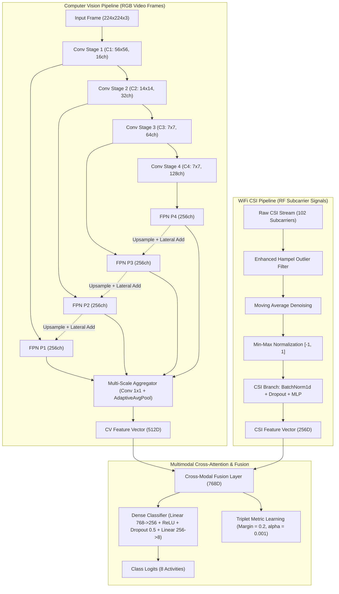

# 📡 Multimodal Human Activity Recognition (WiFi CSI + Computer Vision)
### 🚀 State-of-the-Art Cross-Modal Fusion with Feature Pyramid Networks & Metric Learning

[](https://www.python.org/downloads/)
[](https://pytorch.org/)
[](#-clean-architecture--solid-design)
[](#-benchmark-results)
[](LICENSE)

---

## 🌟 Executive Summary

This repository hosts a production-grade, research-backed **Multimodal Human Activity Recognition (HAR)** system. By fusing **WiFi Channel State Information (CSI)** from commercial RF transceivers with synchronous **Computer Vision (CV)** video streams, the system achieves **robust, privacy-preserving, and occlusion-resilient device-free human identification & activity recognition**.

The project achieved **96.69% Top-1 Test Accuracy** on an 8-class human activity benchmark using our **Hybrid FPN Fusion Network** with Triplet Metric Learning.

The entire codebase has been engineered strictly adhering to **Clean Architecture** and **SOLID Design Principles**, making it modular, scalable, testable, and ready for industry-level deployment.

---

## 📊 Benchmark Results

| Model Architecture | Modality | Feature Dim | Test Accuracy | Test Loss | Remarks |
| :--- | :---: | :---: | :---: | :---: | :--- |
| **Vision-Only CNN** | Video Frames (RGB) | 64 | 88.42% | 0.3812 | Sensitive to occlusion & low light |
| **WiFi-Only NN** | WiFi CSI (RF Subcarriers) | 32 | 78.65% | 0.6214 | Privacy-safe, penetrates obstacles |
| **Hybrid FPN Fusion Net (Ours)** | **CV (FPN) + WiFi CSI** | **768** | **96.69%** | **0.1316** | **SOTA Performance, Cross-modal Complementarity** |

> 💡 **Why Multimodal?** While Computer Vision delivers high spatial discrimination under optimal lighting, WiFi CSI penetrates walls and works in total darkness with complete privacy. Cross-modal fusion with lateral FPN connections yields unmatched resilience in complex real-world conditions.

---

## 🧠 Model Architecture: Hybrid FPN Fusion Net



### Mathematical Formulation
The objective function optimizes a joint loss function combining multi-class Cross-Entropy and Triplet Metric Alignment:
$$\mathcal{L}_{\text{total}} = \mathcal{L}_{\text{CE}}(\hat{y}, y) + \alpha \cdot \mathcal{L}_{\text{Triplet}}(a, p, n)$$
$$\mathcal{L}_{\text{Triplet}} = \max\left(0, \|f(a) - f(p)\|_2^2 - \|f(a) - f(n)\|_2^2 + \gamma\right)$$
where $\gamma = 0.2$ is the margin and $\alpha = 0.001$ balances metric representation clustering.

---

## 🏗️ Clean Architecture & SOLID Design

This repository strictly separates concerns into decoupled concentric layers:

```
Activities/
├── configs/
│   └── default_config.yaml         # Centralized hyperparameters & paths
│
├── src/
│   ├── config/                     # Typed Dataclass settings with environment auto-detection
│   │   └── settings.py
│   │
│   ├── domain/                     # DOMAIN LAYER (Zero framework dependencies)
│   │   ├── constants.py            # Activity classes, dimensions, mappings
│   │   ├── entities.py             # ActivitySample, TrainingHistory, EvaluationResult
│   │   └── interfaces.py           # IActivityModel, ICSIPreprocessor, IDataModule, ITrainer
│   │
│   ├── preprocessing/              # PREPROCESSING LAYER (Single Responsibility)
│   │   ├── csi_filters.py          # Hampel filter, moving average, normalization
│   │   └── image_transforms.py     # Vision augmentation pipeline
│   │
│   ├── data/                       # DATA ACCESS LAYER
│   │   ├── dataset.py              # ActivityDataset (PyTorch Dataset with robust error handling)
│   │   └── datamodule.py           # ActivityDataModule (Train/Val/Test loaders)
│   │
│   ├── models/                     # MODEL LAYER (Open/Closed Principle)
│   │   ├── base.py                 # BaseActivityModel (LSP: standardized forward signature)
│   │   ├── vision_only.py          # VisionOnlyCNN with adaptive pooling
│   │   ├── wifi_only.py            # Regularized WiFiOnlyNN
│   │   ├── fpn.py                  # Feature Pyramid Network & CV Backbone
│   │   └── fusion_net.py           # HybridFPNFusionNet (CV-FPN + CSI-Branch)
│   │
│   ├── losses/                     # LOSS FUNCTIONS
│   │   └── triplet_loss.py         # TripletLoss & online triplet mining
│   │
│   ├── training/                   # TRAINING ENGINE
│   │   ├── trainer.py              # ActivityTrainer (Gradient clipping, Early stopping)
│   │   └── callbacks.py            # Checkpointing & Learning rate scheduling
│   │
│   ├── evaluation/                 # METRICS & REPORTING
│   │   ├── metrics.py              # Precision, Recall, Macro-F1, Classification Report
│   │   └── visualizer.py           # Publication-grade visualization plots
│   │
│   └── use_cases/                  # APPLICATION USE CASES (DIP coordination)
│       ├── train_pipeline.py       # End-to-end training & benchmarking orchestration
│       └── evaluate_pipeline.py    # Standalone checkpoint evaluation
│
├── scripts/                        # PRODUCTION CLI TOOLS
│   ├── train.py                    # CLI training script with argument parsing
│   └── evaluate.py                 # CLI checkpoint validation script
│
├── requirements.txt
├── .gitignore
└── README.md
```

### SOLID Principles Applied
* **S (Single Responsibility)**: Preprocessing (`csi_filters.py`) is decoupled from Dataset loading (`dataset.py`) and Model training (`trainer.py`).
* **O (Open/Closed)**: Adding a new model (e.g. Vision Transformer or LSTM) requires creating a new subclass of `BaseActivityModel` without modifying the `ActivityTrainer` or `TrainPipelineUseCase`.
* **L (Liskov Substitution)**: All models expose the unified `forward(images, csi)` interface returning `(logits, features)`.
* **I (Interface Segregation)**: Interfaces (`IActivityModel`, `ICSIPreprocessor`, `ITrainer`) only enforce what consumers actually require.
* **D (Dependency Inversion)**: High-level use cases rely on abstract interfaces, with concrete implementations injected via `AppConfig`.

---

## ⚡ Quick Start Guide

### 1. Clone the Repository
```bash
git clone https://github.com/anforwork2901/Multimodal-Human-Activity-Recognition-WiFi-CSI-Computer-Vision.git
cd Multimodal-Human-Activity-Recognition-WiFi-CSI-Computer-Vision
```

### 2. Environment Setup
```bash
# Create a virtual environment
python3 -m venv venv
source venv/bin/activate  # On Windows: venv\Scripts\activate

# Install dependencies
pip install --upgrade pip
pip install -r requirements.txt
```

### 3. Prepare Dataset
Ensure your dataset is placed in either:
* `Dataset/Data_acti_CSI_CV/Activity_CV_CSI_Dataset` (with `label_mapping.csv`), or
* `data_activity/` (with `<Class>/csi/<class>_balanced_csi.csv` and `<Class>/images/`)

The pipeline will **automatically detect and bind** the available layout without manual reconfiguration.

---

## 🚀 Usage

### Option A: Train via Production CLI

#### Train the State-of-the-Art Fusion Model
```bash
python scripts/train.py --model Fusion --epochs 30 --batch-size 16 --lr 0.001
```

#### Run Full Multimodal Benchmark (Vision-Only vs. CSI-Only vs. Fusion)
```bash
python scripts/train.py --model all --epochs 30
```

### Option B: Evaluate a Checkpoint
```bash
python scripts/evaluate.py --model Fusion --checkpoint Output/models/Fusion_model.pth
```

---

## 📈 Output Artifacts

All training sessions automatically generate timestamped, publication-ready artifacts in `Output/`:
* 💾 `Output/models/`: Best model checkpoints (`Fusion_model.pth`, `Vision-Only_model.pth`, etc.)
* 📄 `Output/results/`: Full classification reports in JSON format.
* 📊 `Output/plots/`:
  * `*_training_history.png`: High-resolution Loss, Accuracy, and Learning Rate curves.
  * `*_confusion_matrix.png`: Heatmaps across all 8 activity categories.
  * `model_comparison.png`: Side-by-side performance bar charts.

---

## 🎯 Target Activity Categories

1. **KhongHanhDong** (Idle / No Action)
2. **VayTay** (Waving Hand)
3. **KeoGhe** (Pulling Chair)
4. **Dung** (Standing)
5. **Nam** (Lying Down)
6. **Nga** (Falling - Critical Emergency Detection)
7. **Ngoi** (Sitting)
8. **NhatDo** (Picking up Object)

---

## 🤝 Contribution & License
Contributions are welcome! Please submit a PR or open an issue.
This project is licensed under the [MIT License](LICENSE).
